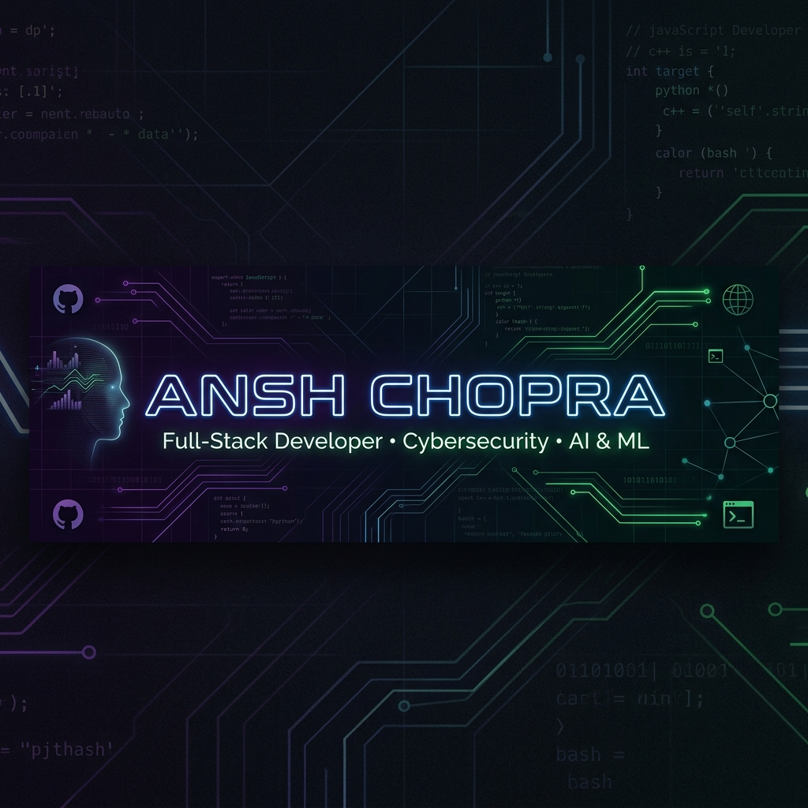

# 
👋 Welcome to My Profile!

  

  

  

<h3>
💻 Software Developer | ML & DL Developer from INDIA 🇮🇳
</h3>

  
  

---

## 🎯 About Me

I am a passionate **Full-Stack Developer** and **Cybersecurity Enthusiast** who loves building highly interactive, performant, and secure digital experiences. Whether it's crafting slick user interfaces with React, engineering secure system-level components, or training machine learning models, I love dive-deep hacking and problem-solving.

- 👦 Pronouns: **He / Him**
- 💻 Currently building next-generation web platforms & engineering secure utilities.
- 🛡️ Actively diving deeper into **Advanced Cryptography**, **Cybersecurity**, and **DevOps**.
- 🚀 Collaborating on open-source projects and advanced architecture systems.

---

## 🔗 Connect & Build with Me

Let's collaborate or chat about tech! Feel free to reach out on any of these platforms:

  
  
  
  
  

---

## 🛠️ Tech Stack & Skills

<b>💻 Programming Languages & Frameworks</b>

 

  

<b>🎨 Frontend & Design Technologies</b>

 

  

<b>🗄️ Backend & Database Systems</b>

 

  

<b>☁️ Cloud & DevOps (Learning)</b>

 

  

<b>🛡️ Security & Development Tools</b>

 

  

---

## 📂 Featured Projects

Here are some of the key repositories I've built and engineered:

  <table border="0">
    <tr>
      <td width="50%" align="center">
        
      </td>
      <td width="50%" align="center">
        
      </td>
    </tr>
    <tr>
      <td width="50%" align="center">
        
      </td>
      <td width="50%" align="center">
        
      </td>
    </tr>
  </table>

---

## 📈 Detailed Contribution Metrics

  

---

## 📊 GitHub Analytics

  <table border="0">
    <tr>
      <td align="center">
        
      </td>
      <td align="center">
        
      </td>
    </tr>
  </table>

---

## 🐍 GitHub Contribution Snake

  <picture>
    <source media="(prefers-color-scheme: dark)" srcset="https://raw.githubusercontent.com/Anshchopra07/Anshchopra07/output/github-snake-dark.svg" />
    <source media="(prefers-color-scheme: light)" srcset="https://raw.githubusercontent.com/Anshchopra07/Anshchopra07/output/github-snake.svg" />
    
  </picture>

